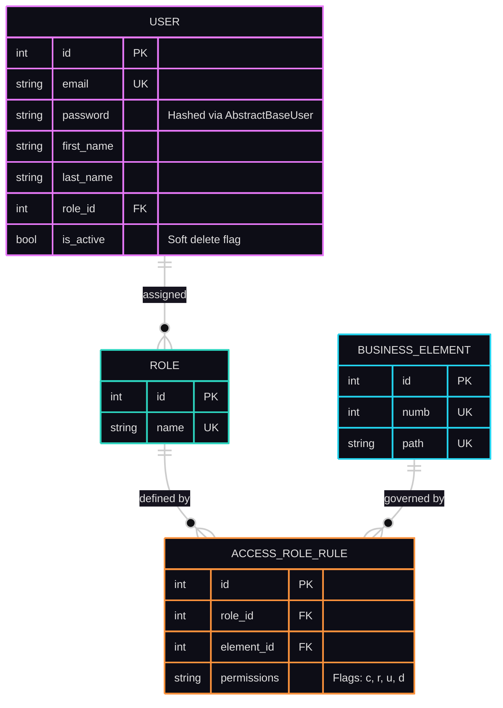

# aaa
(just) Another Authentication App
made with <3 by [@ponchoima](http://ponchoima.dev).

## ER Diagram

```mermaid
---
config:
  look: neo
  theme: redux-dark-color
---
erDiagram
    USER ||--o{ ROLE : "assigned"
    ROLE ||--o{ ACCESS_ROLE_RULE : "defined by"
    BUSINESS_ELEMENT ||--o{ ACCESS_ROLE_RULE : "governed by"

    USER {
        int id PK
        string email UK
        string password "Hashed via AbstractBaseUser"
        string first_name
        string last_name
        int role_id FK
        bool is_active "Soft delete flag"
    }

    ROLE {
        int id PK
        string name UK
    }

    BUSINESS_ELEMENT {
        int id PK
        int numb UK
        string path UK
    }

    ACCESS_ROLE_RULE {
        int id PK
        int role_id FK
        int element_id FK
        string permissions "Flags: c, r, u, d"
    }
```
